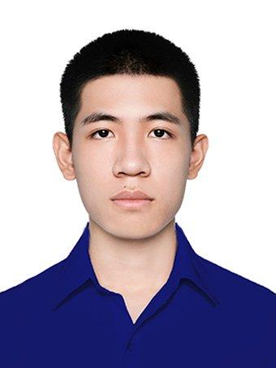

We are a team based in the [School of Computing, National University of Singapore](https://www.comp.nus.edu.sg).

You can reach us at the email `seer[at]comp.nus.edu.sg`

## Project team

### Yongqing Lim

* Role: Developer
* Responsibilities: Implementation, testing

[[github](https://github.com/lyq1375560)]

### Tran Gia Huy

[[github](http://github.com/Unknown15082)]

* Role: Developer
* Responsibilities: Dev Ops + Threading

### Hazel Nur Hidayah

[[github](http://github.com/hazelhidayah)]

* Role: Developer
* Responsibilities: UI

### coder114514

[[homepage]](https://coder114514.github.io/)
[[github](http://github.com/coder114514)]

* Role: Developer
* Responsibilities: ?

### Sureshkumar Sheasu

[[github](https://github.com/Sheasu)]

* Role: Developer
* Responsibilities: Data

