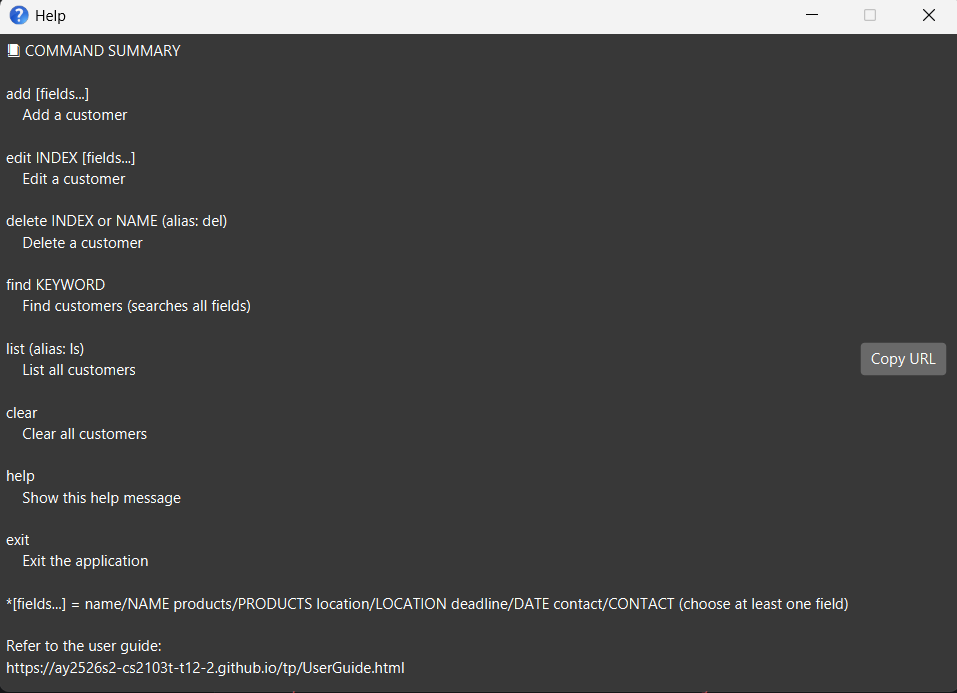

ClientEase is a **desktop app for managing contacts, optimized for use via a Command Line Interface** (CLI) while still having the benefits of a Graphical User Interface (GUI). If you can type fast, ClientEase can get your contact management tasks done faster than traditional GUI apps.

* Table of Contents
{:toc}

--------------------------------------------------------------------------------------------------------------------

## Quick start

1. Ensure you have Java `17` or above installed in your Computer. 
   **Mac users:** Ensure you have the precise JDK version prescribed [here](https://se-education.org/guides/tutorials/javaInstallationMac.html).

1. Download the latest `.jar` file from [here](https://github.com/AY2526S2-CS2103T-T12-2/tp/releases).

1. Copy the file to the folder you want to use as the _home folder_ for your ClientEase.

1. Open a command terminal, `cd` into the folder you put the jar file in, and use the `java -jar clientease.jar` command to run the application. 
   A GUI similar to the below should appear in a few seconds. Note how the app contains some sample data. 
   

1. Type the command in the command box and press Enter to execute it. e.g. typing **`help`** and pressing Enter will open the help window. 
   Some example commands you can try:

   * `list` : Lists all contacts.

   * `add name/John Doe products/Chocolate Cake location/John street, block 123, #01-01 deadline/2026-03-10 contact/johnd@example.com` : Adds a customer named `John Doe` to ClientEase.

   * `delete 3` : Deletes the 3rd contact shown in the current list.

   * `clear` : Deletes all contacts.

   * `exit` : Exits the app.

1. Refer to the [Features](#features) below for details of each command.

--------------------------------------------------------------------------------------------------------------------

## Features

**:information_source: Notes about the command format:** 

* Words in `UPPER_CASE` are the parameters to be supplied by the user. 
  e.g. in `add name/NAME`, `NAME` is a parameter which can be used as `add name/John Doe`.

* Items in square brackets are optional. 
  e.g `name/NAME [products/PRODUCTS]` can be used as `name/John Doe products/Muffin` or as `name/John Doe`.

* Items with `…`​ after them can be used multiple times including zero times. 
  ClientEase does not currently use repeatable prefixes in its commands.

* Parameters can be in any order. 
  e.g. if the command specifies `name/NAME products/PRODUCTS`, `products/PRODUCTS name/NAME` is also acceptable.

* Extraneous parameters for commands that do not take in parameters (such as `help`, `list`, `exit` and `clear`) will be ignored. 
  e.g. if the command specifies `help 123`, it will be interpreted as `help`.

* If you are using a PDF version of this document, be careful when copying and pasting commands that span multiple lines as space characters surrounding line-breaks may be omitted when copied over to the application.

### Viewing help : `help`

Shows a message explaining how to access the help page.

Format: `help`

### Adding a person: `add`

Adds a person to ClientEase.

Format: `add name/NAME [products/PRODUCTS] [location/LOCATION] [deadline/DATE] [contact/CONTACT]`

:bulb: **Tip:**
Products are limited to these placeholder items: Muffin, Chocolate Cake, Vanilla Cake, Brownie, Cookie.
Enter them as a comma-separated list (up to 5 items), e.g. `products/Chocolate Cake, Muffin`.

Examples:
* `add name/John Doe products/Chocolate Cake location/John street, block 123, #01-01 deadline/2026-03-10 contact/johnd@example.com`
* `add name/Betsy Crowe products/Vanilla Cake, Cookie contact/12345678`

### Listing all persons : `list`

Shows a list of all persons in ClientEase.

Format: `list`

### Editing a person : `edit`

Edits an existing person in ClientEase.

Format: `edit INDEX [name/NAME] [products/PRODUCTS] [location/LOCATION] [deadline/DATE] [contact/CONTACT]`

* Edits the person at the specified `INDEX`. The index refers to the index number shown in the displayed person list. The index **must be a positive integer** 1, 2, 3, …​
* At least one of the optional fields must be provided.
* Existing values will be updated to the input values.
* Products must be chosen from the placeholder list: Muffin, Chocolate Cake, Vanilla Cake, Brownie, Cookie.

Examples:
*  `edit 1 contact/91234567` Edits the contact of the 1st person to be `91234567`.
*  `edit 2 name/Betsy Crower products/Muffin location/Newgate Prison` Edits the name, products, and location of the 2nd person.

### Locating persons by name: `find`

Finds persons whose names contain any of the given keywords.

Format: `find KEYWORD [MORE_KEYWORDS]`

* The search is case-insensitive. e.g `hans` will match `Hans`
* The order of the keywords does not matter. e.g. `Hans Bo` will match `Bo Hans`
* Only the name is searched.
* Only full words will be matched e.g. `Han` will not match `Hans`
* Persons matching at least one keyword will be returned (i.e. `OR` search).
  e.g. `Hans Bo` will return `Hans Gruber`, `Bo Yang`

Examples:
* `find John` returns `john` and `John Doe`
* `find alex david` returns `Alex Yeoh`, `David Li` 
  

### Deleting a person : `delete`

Deletes the specified person from ClientEase.

Format: `delete INDEX`

* Deletes the person at the specified `INDEX`.
* The index refers to the index number shown in the displayed person list.
* The index **must be a positive integer** 1, 2, 3, …​

Examples:
* `list` followed by `delete 2` deletes the 2nd person in ClientEase.
* `find Betsy` followed by `delete 1` deletes the 1st person in the results of the `find` command.

### Clearing all entries : `clear`

Clears all entries from ClientEase.

Format: `clear`

### Exiting the program : `exit`

Exits the program.

Format: `exit`

### Saving the data

ClientEase data are saved in the hard disk automatically after any command that changes the data. There is no need to save manually.

### Editing the data file

ClientEase data are saved automatically as a JSON file `[JAR file location]/data/addressbook.json`. Advanced users are welcome to update data directly by editing that data file.

:exclamation: **Caution:**
If your changes to the data file makes its format invalid, ClientEase will discard all data and start with an empty data file at the next run. Hence, it is recommended to take a backup of the file before editing it. 
Furthermore, certain edits can cause ClientEase to behave in unexpected ways (e.g., if a value entered is outside of the acceptable range). Therefore, edit the data file only if you are confident that you can update it correctly.

### Archiving data files `[coming in v2.0]`

_Details coming soon ..._

--------------------------------------------------------------------------------------------------------------------

## FAQ

**Q**: How do I transfer my data to another Computer? 
**A**: Install the app in the other computer and overwrite the empty data file it creates with the file that contains the data of your previous ClientEase home folder.

--------------------------------------------------------------------------------------------------------------------

## Known issues

1. **When using multiple screens**, if you move the application to a secondary screen, and later switch to using only the primary screen, the GUI will open off-screen. The remedy is to delete the `preferences.json` file created by the application before running the application again.
2. **If you minimize the Help Window** and then run the `help` command (or use the `Help` menu, or the keyboard shortcut `F1`) again, the original Help Window will remain minimized, and no new Help Window will appear. The remedy is to manually restore the minimized Help Window.

--------------------------------------------------------------------------------------------------------------------

## Command summary

Action | Format, Examples
--------|------------------
**Add** | `add name/NAME [products/PRODUCTS] [location/LOCATION] [deadline/DATE] [contact/CONTACT]`   e.g., `add name/James Ho products/Chocolate Cake location/123, Clementi Rd deadline/2026-03-10 contact/jamesho@example.com`
**Clear** | `clear`
**Delete** | `delete INDEX`  e.g., `delete 3`
**Edit** | `edit INDEX [name/NAME] [products/PRODUCTS] [location/LOCATION] [deadline/DATE] [contact/CONTACT]`  e.g.,`edit 2 name/James Lee contact/jameslee@example.com`
**Find** | `find KEYWORD [MORE_KEYWORDS]`  e.g., `find James Jake`
**List** | `list`
**Help** | `help`
