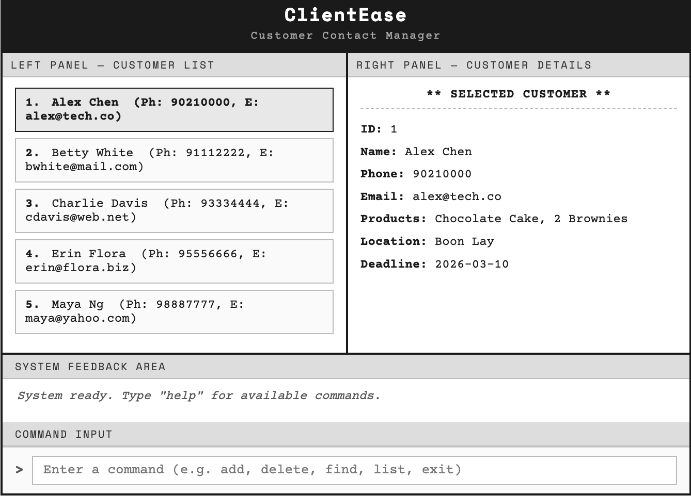
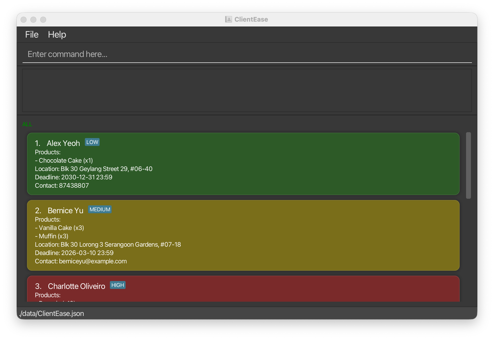
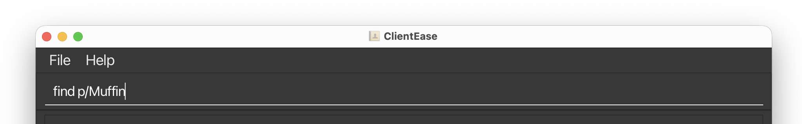

# ClientEase User Guide

**ClientEase is a lightweight customer contact manager designed for tech-savvy home-based online business owners** who manage a small to medium customer base,
perform frequent daily updates to customer contact information, and prefer fast, command-line-style text input over
GUI-driven interactions.

Instead of clicking through multiple menus, ClientEase lets you type short commands to add customers, search by fields,
track products and deadlines, and retrieve information instantly, keeping your records organised without the overhead
of full-scale business management systems.

**Scenario:** You run a home bakery and receive orders through chat and email. Throughout the day you need to update
phone numbers, delivery locations, and due dates quickly while keeping a clear view of open orders. ClientEase lets you
do those updates in seconds with short commands, without switching between multiple windows.

- If you are new to ClientEase, start with the [Quick Start](#quick-start) section.
- If you are looking for a specific command, jump to the [Command Summary](#command-summary).
- If you are a developer, refer to the [Developer Guide](https://ay2526s2-cs2103t-t12-2.github.io/tp/DeveloperGuide.html).

---

## Table of Contents

- [Who Is This Guide For?](#who-is-this-guide-for)
- [Quick Start](#quick-start)
    - [Installation](#installation)
    - [Overview of the Interface](#overview-of-the-interface)
    - [Your First Commands](#your-first-commands)
- [General Usage Notes](#general-usage-notes)
    - [Notes on Command Format](#notes-on-command-format)
    - [Data Normalisation](#data-normalisation)
    - [The "Unique Name" Rule](#the-unique-name-rule)
    - [Parameter Reference](#parameter-reference)
- [Features](#features)
    - [Viewing Help : `help`](#viewing-help--help)
    - [Adding a Customer : `add`](#adding-a-customer--add)
    - [Listing All Customers : `list`](#listing-all-customers--list)
    - [Managing Products : `product`](#managing-products--product)
    - [Editing a Customer : `edit`](#editing-a-customer--edit)
    - [Locating Customers : `find`](#locating-customers--find)
    - [Deleting a Customer : `delete`](#deleting-a-customer--delete)
    - [Clearing All Customers : `clear`](#clearing-all-customers--clear)
    - [Exiting the App : `exit`](#exiting-the-app--exit)
- [Saving the Data](#saving-the-data)
- [Editing the Data File](#editing-the-data-file)
- [FAQ](#faq)
- [Known Issues](#known-issues)
- [Command Summary](#command-summary)
- [Glossary](#glossary)

---

## Who Is This Guide For?

ClientEase is built for **home-based online business owners** who:

- Manage a **small to medium customer base** (typically under a few hundred contacts)
- Perform **frequent daily updates** to customer information, such as new orders, contact changes, or delivery deadlines
- Prefer **keyboard-driven workflows** over clicking through menus

This guide assumes you are comfortable with:

| Assumed Skill | What It Means in Practice |
|---|---|
| Basic terminal use | Opening a terminal, using `cd` to navigate folders, running `java -jar` commands |
| Simple command syntax | Typing structured commands like `add name/John Doe contact/98765432` |
| Reading on-screen feedback | Interpreting short success or error messages shown in the app |
| Basic data awareness | Understanding that your data is stored in a local file, and knowing to back it up |

> ℹ️ **Not sure if ClientEase is right for you?** If you manage more than a few hundred customers with complex team
> workflows, you may want a full-scale customer relationship management (CRM) system instead.

[↑ Back to Table of Contents](#table-of-contents)

---

## Quick Start

### Installation

1. Ensure you have **[Java 17 or above](https://www.oracle.com/java/technologies/downloads/#java17)** installed. Verify by opening a terminal and running:
   ```
   java -version
   ```
   If Java is not installed or the version is below 17, expand the section for your operating system below:

   <details>
   <summary>🪟 Windows</summary>

   Download and install [Java 17 for Windows](https://www.oracle.com/java/technologies/downloads/#java17-windows) from Oracle.
   After installing, open **Command Prompt** (`Win + R`, type `cmd`, press Enter) and verify with:
   ```
   java -version
   ```

   </details>

   <details>
   <summary>🍎 macOS</summary>

   Ensure you have the precise JDK version prescribed [here](https://se-education.org/guides/tutorials/javaInstallationMac.html).

   </details>

   <details>
   <summary>🐧 Linux</summary>

   Install Java 17 using your package manager. For example, on Ubuntu or Debian:
   ```
   sudo apt update && sudo apt install openjdk-17-jdk
   ```
   Then verify with `java -version`.

   </details>

2. Download the latest **`ClientEase.jar`** file from the
   [releases page here](https://github.com/AY2526S2-CS2103T-T12-2/tp/releases).

3. Move the file to a folder you want to use as your **home folder** (e.g., `~/ClientEase/`).

4. Open a terminal and navigate to that folder:

   <details>
   <summary>🪟 Windows</summary>

   Open **Command Prompt** and run (replace the path with your actual folder location):
   ```
   cd C:\Users\YourName\ClientEase
   ```

   </details>

   <details>
   <summary>🍎 macOS / 🐧 Linux</summary>

   Open **Terminal** and run:
   ```
   cd ~/ClientEase
   ```

   </details>

5. Run the application:
   ```
   java -jar ClientEase.jar
   ```

   ClientEase will launch with a set of sample customer data so you can explore right away.

[↑ Back to Table of Contents](#table-of-contents)

---

### Overview of the Interface



The screenshot above shows the main ClientEase window. The table below describes each numbered area:

| Area | Purpose |
|---|---|
| **Command Box** (top) | Where you type your commands. |
| **Result Display** (below command box) | Shows success messages or error feedback after each command. |
| **Customer List Panel** | Displays all customers. Cards are colour-coded by **Priority Level** (Green/Yellow/Red) based on total product quantity when products are provided. |
| **Priority Badge** | A small tag (LOW, MEDIUM, HIGH) shown next to the name when the customer has products. |
| **Status Bar** (bottom) | Shows the data file save location. |

[↑ Back to Table of Contents](#table-of-contents)

---

### Your First Commands

Here is a short walkthrough to get familiar with ClientEase. Try each command by typing it into the command box and
pressing **Enter**.

**Step 1 - See what's already in the app:**
```
list
```
Expected output: All sample customers are shown in the Customer List Panel.

**Step 2 - Add your first real customer:**
```
add name/Jane Tan
    contact/91234567;jane@mybusiness.com
    products/Chocolate Cake:2, Muffin:5
    location/Tampines
    deadline/2025-12-31
```
Enter the full command as a single line in the application. The text may wrap visually in this guide, but do not press Enter until the full command has been typed.
Expected output: `Added Customer: Jane Tan`

**Step 3 - Find a customer by name:**
```
find name/Jane
```
Expected output: Only customers whose name matches "Jane" are shown.

**Step 4 - Update a customer's contact details:**
```
edit 1 contact/99887766
```
Expected output: The first customer's contact details are updated.

**Step 5 - Delete a customer:**
```
delete 1
```
Expected output: The 1st customer in the list is deleted.

**Step 6 - Exit the app:**
```
exit
```
Expected output: `Goodbye! Exiting ClientEase. You have <N> customer(s) saved.`

> 💡 **Tip:** All your data is saved automatically after every command. You never need to press a "Save" button.

[↑ Back to Table of Contents](#table-of-contents)

---

## General Usage Notes

### Notes on Command Format

> ℹ️ **Read this before using any command.**

- Words in `UPPER_CASE` are **parameters you supply**. For example, in `add name/NAME`, replace `NAME` with the actual
  name, e.g. `add name/John Doe`.
- Items in `[square brackets]` are **optional**. For example, `name/NAME [contact/CONTACT]` can be used with or without
  a contact.
- Parameters can be entered **in any order**. For example, `add name/John Doe contact/98765432` is the same as
  `add contact/98765432 name/John Doe`.
- Commands that do not take parameters, such as `help`, `list`, `clear`, `exit`, and `product list`, will **ignore any extra text** you type after them.
- Example: `help please` works the same as `help`.
- Example: `product list now` works the same as `product list`.
- If a long command wraps visually in this guide, type it as a single line in the application.
- If you are using a **PDF version** of this guide, be careful when copying multi-line commands — line breaks may cause
  spaces to be omitted.

[↑ Back to Table of Contents](#table-of-contents)

---

### Data Normalisation

To keep stored data consistent and reduce accidental duplicates, ClientEase normalises some input before saving it.

#### Contact numbers

- Spaces in phone numbers are removed before storage.
- Example: `+65 9123 4567` is stored internally as `+6591234567`.
- Email addresses are converted to lowercase before storage.

#### Search behaviour

- The `find` command matches against stored values.
- When searching by contact number, omit spaces in your search term.
- Example: use `find c/+6591234567` instead of `find c/+65 9123 4567`.

> ❗ **Important:** This applies only to spaces in phone numbers. Hyphens and parentheses are not accepted as valid phone-number input.

[↑ Back to Table of Contents](#table-of-contents)

---

### The "Unique Name" Rule

ClientEase is designed for maximum efficiency. To allow you to delete customers using only their names, instead of relying only on index numbers, the system requires every customer to have a unique name.

Why? This ensures that commands like `delete John Doe` are always unambiguous and fast to execute.

Handling namesakes: If one customer is `John Doe` and you need to distinguish a second customer with the same name, we recommend giving the second customer a distinguishing suffix, for example `John Doe Jr`.

[↑ Back to Table of Contents](#table-of-contents)

---

### Parameter Reference

This section defines all parameters used across commands.

---

<a id="param-name"></a>
#### `name/NAME`

| Field | Details |
|---|---|
| **Required?** | Yes for `add`; optional for `edit` |
| **Length** | 1–100 characters after trimming and space normalisation |
| **Allowed characters** | ASCII letters (A–Z) and spaces; special characters `.` `'` `-` are permitted but at least one letter must be present |
| **Uniqueness** | Names are unique case-insensitively and with repeated spaces collapsed |
| **Shorthand** | `n/` |

---

<a id="param-products"></a>
#### `products/PRODUCTS`

| Field | Details |
|---|---|
| **Required?** | No |
| **Format** | Comma-separated product names from the product catalogue |
| **Quantities** | Append `:N` to specify a quantity (e.g. `Muffin:3`); defaults to 1 if omitted. Must be a positive integer — `0` is not accepted |
| **Limits** | Max 10,000 per product; max 100,000 total |
| **Matching** | Case-insensitive; spaces normalised |
| **Duplicates** | Allowed — quantities are summed |
| **Shorthand** | `p/` |

> ℹ️ **Note:** Products must exist in the product catalogue before they can be referenced. Use [`product add`](#managing-products--product) to create them first. Product names cannot contain `,` or `:`.

---

<a id="param-location"></a>
#### `location/LOCATION`

| Field | Details |
|---|---|
| **Required?** | No |
| **Allowed characters** | Any characters, as long as the value is non-blank after trimming |
| **Length** | Maximum 200 characters |
| **Shorthand** | `l/` |

---

<a id="param-deadline"></a>
#### `deadline/DEADLINE`

| Field | Details |
|---|---|
| **Required?** | No |
| **Accepted formats** | `yyyy-MM-dd HH:mm`, `yyyy-MM-dd`, `dd/MM/yyyy` (24-hour time) |
| **Default time** | 23:59 if no time is provided |
| **Validation** | Invalid dates (e.g. 2027-02-29) are rejected |
| **Shorthand** | `d/` |

---

<a id="param-contact"></a>
#### `contact/CONTACT`

| Field | Details |
|---|---|
| **Required?** | No |
| **Format** | Semicolon-separated entries; each entry is a phone number or email address |
| **Local phone** | 8 digits |
| **International phone** | `+<2–3 digit country code><1–12 digit number>`; spaces in the number are ignored |
| **Email** | Up to 100 characters; must start with alphanumeric; only letters, digits, `.` and `-` allowed; exactly one `@`; domain must start with alphanumeric |
| **Storage** | Phone spaces are removed and emails are lowercased, then entries are sorted |
| **Shorthand** | `c/` |

> ❗ **Important:** Empty entries (e.g. trailing or double `;`) are invalid.

[↑ Back to Table of Contents](#table-of-contents)

---

## Features

### Viewing Help : `help`

Opens a help window that provides a quick overview of available commands and a link to the full User Guide.


**Format:** `help`

> ℹ️ **Notes:**
> - The help window does **not block** the main application — you can continue using ClientEase while it is open.
> - If the help window is already open, running `help` again will focus on the existing window.

> 💡 **Tip:** Use the help window as a quick reference when you forget command formats, instead of searching through the full guide.

[↑ Back to Table of Contents](#table-of-contents)

---

### Adding a Customer : `add`

Adds a new customer record to ClientEase.

**Format:**
```
add name/NAME
    [products/PRODUCTS]
    [location/LOCATION]
    [deadline/DEADLINE]
    [contact/CONTACT]
```

**Parameters:** See [Parameter Reference](#parameter-reference) — [`name/NAME`](#param-name), [`products/PRODUCTS`](#param-products), [`location/LOCATION`](#param-location), [`deadline/DEADLINE`](#param-deadline), [`contact/CONTACT`](#param-contact).

> ❗ **Important:** ClientEase automatically tags customers with a priority colour based on the **total quantity** of products.
> * **🟢 Green (Low):** 1–5 total items
> * **🟡 Yellow (Medium):** 6–10 total items
> * **🔴 Red (High):** 11 or more total items
> * No priority tag is shown if the customer has no products.


**Other constraints:**

- Each prefix can appear at most once.
- Unrecognised `<word>/` prefixes are rejected.
- For optional fields, if a prefix is provided with no value (e.g. `products/`), the field is treated as empty.
- Non-ASCII characters (e.g. Chinese) are rejected in `name/` and `contact/`.

> ⚠️ **Warning:** If you try to add a customer with a name that already exists (case-insensitive, extra spaces ignored),
> ClientEase will reject the entry and display an error. Check the existing list with `list` before adding.

**Products are shown as a bulleted list with quantities (e.g., `- Muffin (x2)`). If no products are provided, the card shows `Products: None`.**

**Examples:**

**Example 1: Add a customer with full details**
```
add name/John Doe
    contact/98765432;johnd@example.com
    products/Chocolate Cake:2, Muffin:5
    location/Clementi Ave 2
    deadline/2025-12-31
```
Enter the full command as a single line in the application.
Effect: Adds a customer named John Doe with products, location, deadline (31 Dec 2025 at 23:59), and contact details.


**Example 2: Add a customer with name only**
```
add name/Sarah Lim
```
Effect: Adds a customer named Sarah Lim with no other details. You can `edit` to fill in the rest later.

[↑ Back to Table of Contents](#table-of-contents)

---

### Listing All Customers : `list`

Shows a list of all customers in ClientEase.

**Format:** `list`

[↑ Back to Table of Contents](#table-of-contents)

---

### Managing Products : `product`

Manages the product catalogue used by `add` and `edit`.

**Formats:**
```
product add product/NAME   (or p/NAME)
product delete product/NAME   (or p/NAME)
product list
```

> ℹ️ **Notes:**
> - Product names are case-insensitive with spaces normalised.
> - Product names must be non-blank and cannot contain `,` or `:`.
> - You cannot delete a product if any customer is currently using it.
> - `product` commands, subcommands, and the `product/` or `p/` prefix are case-insensitive.
> - `product list` shows products in alphabetical order.
> - If the catalogue is empty, `add` and `edit` will reject any `products/` input and show "(no products in catalog)" in the allowed list.

**Examples:**
- `product add product/Muffin`
- `product delete p/Muffin`
- `product list`

<table><tr><td></td><td></td></tr></table>

[↑ Back to Table of Contents](#table-of-contents)

---

### Editing a Customer : `edit`

Edits an existing customer in ClientEase.

**Format:**
```
edit INDEX
    [name/NAME]
    [products/PRODUCTS]
    [location/LOCATION]
    [deadline/DATE]
    [contact/CONTACT]
```

**Parameters:** See [Parameter Reference](#parameter-reference) — [`name/NAME`](#param-name), [`products/PRODUCTS`](#param-products), [`location/LOCATION`](#param-location), [`deadline/DEADLINE`](#param-deadline), [`contact/CONTACT`](#param-contact).

- Edits the customer at the specified `INDEX`. The index refers to the index number shown in the displayed customer list. The index **must be a positive integer** 1, 2, 3, …
- At least one of the optional fields must be provided.
- Existing values will be updated to the input values.
- `products/` replaces the customer's entire current product list. Quantity `0` is not accepted.
- To remove one product while keeping others, re-enter the full list of products you want to keep.
- To remove all products from a customer, use an empty products field: `edit INDEX products/`.

**Examples:**

**Example 1: Edit a contact**
```
edit 1 contact/91234567
```
Effect: Updates the contact of the 1st customer to `91234567`.

**Example 2: Edit multiple fields**
```
edit 2 name/Betsy Crower
    products/Muffin
    location/Newgate Prison
```
Effect: Updates the name, products, and location of the 2nd customer.


**Example 3: Remove one product but keep another**
```
edit 1 products/Muffin:2
```
Effect: Replaces the customer's entire product list so that only `Muffin:2` remains.

**Example 4: Remove all products**
```
edit 1 products/
```
Effect: Clears the customer's product list completely.

[↑ Back to Table of Contents](#table-of-contents)

---

### Locating Customers : `find`

Finds customers whose details match the given keywords.

**Format:**
```
find [name/NAME]...
    [contact/CONTACT]...
    [location/LOCATION]...
    [product/PRODUCT]...
```

**Parameters:** See [Parameter Reference](#parameter-reference) — [`contact/CONTACT`](#param-contact), [`location/LOCATION`](#param-location).

Short prefixes are supported: `n/` for `name/`, `c/` for `contact/`, `l/` for `location/`, and `p/` for `product/`.

- `NAME` and `PRODUCT` are single words; `CONTACT` and `LOCATION` are strings. Each field can repeat multiple times.
- At least one field prefix must be provided. Empty values are ignored; if all provided fields are empty (e.g. `find n/`), no customers will be matched.
- The search is case-insensitive. e.g. `hans` will match `Hans`.
- The name, contact, location, and product list of each customer will be searched.
- For name and products, only full words will be matched. e.g. `Han` will not match `Hans`.
- For location and contact, any substring will be matched. e.g. `123` will match `1234@mail.com`.
- Searching multiple personal details (name, contact, or location) or multiple products will match any of those items; however, searching across both categories will only show results that match at least one from each.

> 💡 **Tip:** Phone numbers are matched against the stored normalised value with spaces removed. For example, if a number is stored as `+6591234567`, search with `find c/+6591234567`, not `find c/+65 9123 4567`.

**Examples:**

- `find name/John` returns `john` and `John Doe`
- `find name/alex name/david` returns `Alex Yeoh`, `David Li`





- `find name/alex name/david product/cake` returns `David Li`, where `Alex Yeoh` has `Muffin` and `David Li` has `Chocolate Cake`

[↑ Back to Table of Contents](#table-of-contents)

---

### Deleting a Customer : `delete`

Deletes a customer from ClientEase using either their displayed index or exact name.

**Format:**
```
delete INDEX
```

- Deletes the customer at the specified `INDEX`.
- The index refers to the index number shown in the displayed customer list.
- The index **must be a positive integer** 1, 2, 3, …

**Examples:**

**Example 1: Delete by index**
```
delete 2
```
Effect: Deletes the 2nd customer in the currently displayed list.

**Example 2: Delete after filtering**
```
find name/Betsy
delete 1
```
Effect: Deletes the 1st customer in the filtered results.

```
delete NAME
```

- Deletes the customer with the given `NAME`.
- Matching is **case-insensitive** and ignores extra spaces.

**Examples:**

```
delete John Doe
```
Effect: Deletes the customer named `John Doe` (case-insensitive, extra spaces ignored).


---

### Clearing All Customers : `clear`

Clears all entries from ClientEase.

**Format:** `clear`

> **Warning:** This action is irreversible and will permanently delete all customer records. Consider backing up
> `data/ClientEase.json` (see [Saving the Data](#saving-the-data)) before running this command.

[↑ Back to Table of Contents](#table-of-contents)

---

### Exiting the App : `exit`

Exits the program after displaying a farewell message with the current customer count.

**Format:** `exit`

- A farewell message will be displayed: `Goodbye! Exiting ClientEase. You have  customer(s) saved.`
- The app will close automatically after a short delay.

[↑ Back to Table of Contents](#table-of-contents)

---

## Saving the Data

ClientEase **automatically saves** your data to disk after every command that changes data. There is no Save button and
no need to save manually.

Your data is stored at:
```
[home folder]/data/ClientEase.json
```

[↑ Back to Table of Contents](#table-of-contents)

---

## Editing the Data File

Advanced users may edit the data file directly using any text editor.

> ⚠️ **Caution:** If your changes to the data file make its format invalid, ClientEase will discard all data and start with
> an empty data file at the next run. It is recommended to back up the file before editing it.
>
> Certain edits can also cause **ClientEase** to behave in unexpected ways (e.g., if a value entered is outside the
> acceptable range). Edit the data file only if you are confident that you can update it correctly.

[↑ Back to Table of Contents](#table-of-contents)

---

## FAQ

**Q: How do I transfer my data to another computer?**

A: Install the app in the other computer and overwrite the empty data file it creates with the file that contains the data of your previous ClientEase home folder.

---
**Q: Can I have two customers with the same name?**

A: No. ClientEase treats names as unique identifiers (case-insensitive, extra spaces ignored). If two customers share a
name, consider differentiating them, e.g. `Dr John Doe` and `John Doe Jr`.

[↑ Back to Table of Contents](#table-of-contents)

---

## Known Issues

1. **When using multiple screens**, if you move the application to a secondary screen, and later switch to using only the primary screen, the GUI will open off-screen. **Workaround**: delete the `preferences.json` file created by the application before running the application again.

2. **If you minimise the Help Window** and then run the `help` command (or use the `Help` menu, or the keyboard shortcut `F1`) again, the original Help Window will remain minimised, and no new Help Window will appear. **Workaround**: manually restore the minimised Help Window.

3. **In certain window dimensions**, the layout priority settings may cause names to truncate despite available horizontal space. **Workaround**: Increase the application window width until the text fully expands.

[↑ Back to Table of Contents](#table-of-contents)

---

## Command Summary

| Action | Format | Example |
|---|---|---|
| **Help** | `help` | `help` |
| **Add** | `add name/NAME`<br>`[products/PRODUCTS]`<br>`[location/LOCATION]`<br>`[deadline/DEADLINE]`<br>`[contact/CONTACT]` | `add name/John Doe`<br>`products/Muffin:2`<br>`location/Clementi` |
| **List** | `list` | `list` |
| **Edit** | `edit INDEX`<br>`[name/NAME]`<br>`[products/PRODUCTS]`<br>`[location/LOCATION]`<br>`[deadline/DATE]`<br>`[contact/CONTACT]` | `edit 2 name/James Lee`<br>`contact/jameslee@example.com` |
| **Find** | `find [name/NAME]...`<br>`[contact/CONTACT]...`<br>`[location/LOCATION]...`<br>`[product/PRODUCT]...` | `find name/James` |
| **Delete (index)** | `delete INDEX` | `delete 3` |
| **Delete (name)** | `delete NAME` | `delete John Doe` |
| **Clear** | `clear` | `clear` |
| **Exit** | `exit` | `exit` |
| **Product add** | `product add product/NAME`<br>or `product add p/NAME` | `product add product/Muffin` |
| **Product delete** | `product delete product/NAME`<br>or `product delete p/NAME` | `product delete p/Muffin` |
| **Product list** | `product list` | `product list` |

> 💡 **Tip:** Shorthand prefixes for `add`, `edit`, and `find`: `n/` for `name/`, `p/` for `products/` and `product/`, `l/` for `location/`,
> `d/` for `deadline/`, and `c/` for `contact/`. Example: `add n/John Doe p/Muffin` is equivalent to
> `add name/John Doe products/Muffin`.

[↑ Back to Table of Contents](#table-of-contents)

---

## Glossary

| Term            | Definition                                                                                                                                                             |
|-----------------|------------------------------------------------------------------------------------------------------------------------------------------------------------------------|
| **CLI**         | Command Line Interface - a text-based way of interacting with software by typing commands                                                                              |
| **GUI**         | Graphical User Interface - the visual window of the app                                                                                                                |
| **Customer**    | A record representing an individual who has placed or may place an order with your business                                                                            |
| **Command**     | A text instruction you type into the command box to perform an action                                                                                                  |
| **Parameter**   | A piece of information supplied alongside a command, e.g. `name/John Doe`                                                                                              |
| **Prefix**      | The short label before a parameter value, e.g. `name/`, `products/`, `contact/`                                                                                        |
| **Suffix**      | A letter or set of letters added to the end of a person's last name to indicate their family lineage, honorific title, or professional qualification |
| **Index**       | The number shown beside each customer in the displayed list. It starts from 1.                                                                                         |
| **Deadline**    | A date (and optional time) representing when an order is due                                                                                                           |
| **Contact**     | Consolidated contact details (phone and/or email) for a customer, separated by semicolons                                                                              |
| **Product**     | An item from the product catalogue associated with a customer's order, listed under Products                                                                           |
| **Home folder** | The folder where `clientease.jar` and the `data/` directory are stored                                                                                                 |
| **JSON file**   | The data file (`ClientEase.json`) where ClientEase stores all customer records                                                                                         |

[↑ Back to Table of Contents](#table-of-contents)
